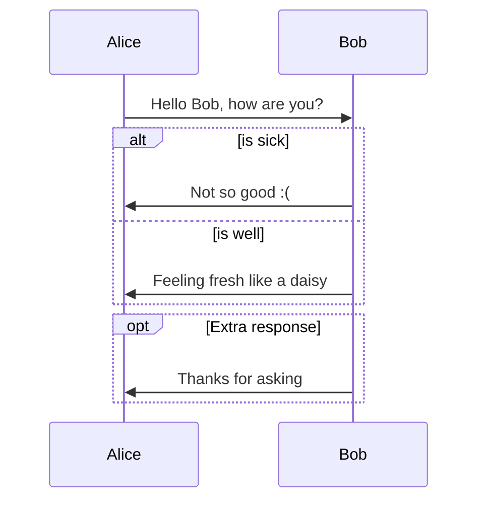
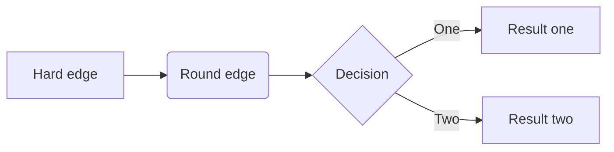
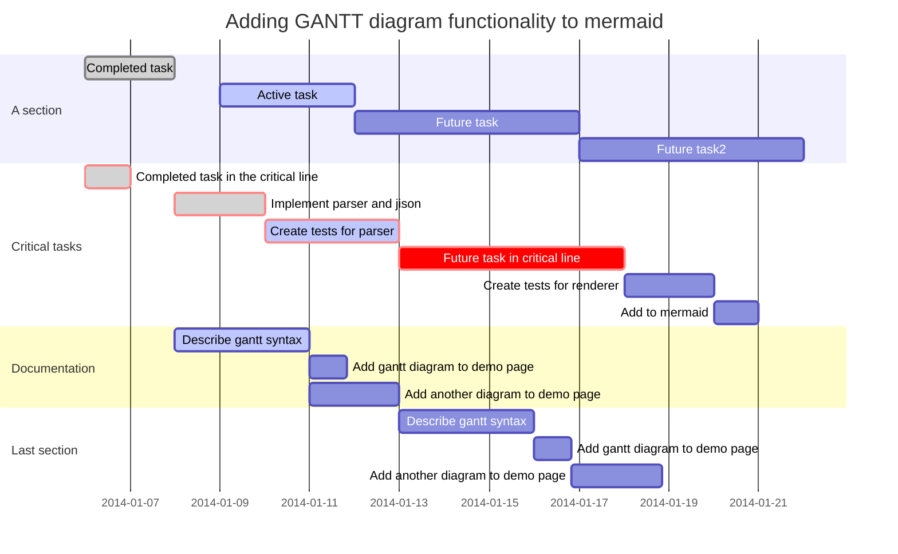

# Typora – Markdown 简介

---------------------------

[Typora官网](https://www.typora.io/)

--------------------------


[TOC]


## Overview

### What’s Markdown?

Markdown是一种可以使用普通文本编辑器编写的标记语言，通过简单的标记语法，它可以使普通文本内容具有一定的格式。Markdown的语法简洁明了、易读易写，并且对于图片，图表、数学式都有支持，人们广泛使用 Markdown 来撰写README帮助文档或论坛博客。例如CSDN、博客园和GitHub的README及Wiki等。

### What’s Typora?

Typora 是一款简单、高效 Markdown 编辑器，支持即时渲染技术，提供了一种“所见即所得”的全新的 Markdown 写作体验。不像其他Markdown编辑器将「编辑」和「显示」相分离，Typora 把源码编辑和效果预览两者合二为一，在输入 Markdown 代码的时候即时渲染生成预览效果，使得你写Markdown就像是写Word文档一样流畅自如，这也是与其他Markdown编辑器最显著的区别。Typora 是目前互联网上最受欢迎的 Markdown 编辑器之一。

**Typora 的优点：**

- 实时渲染：Typora 支持即时渲染，可以在同一个界面实时看到渲染后的效果，所见即所得；
- 扩展语法：Typora 支持 GitHub 风格的 Markdown 语法，还支持部分HTML语法；
- LaTeX公式：支持LaTeX公式编辑；
- 快捷操作：Typora 对常用的 Markdown 语法操作都提供了快捷键操作，用起来非常高效；
- 简单漂亮：Typora 默认支持 5 种主题，可自由切换，操作简单，非常容易上手；
- 跨平台：Typora 支持 macOS、Windows 和Linux系统；
- 免费：Typora 完全免费，这点很重要。

You can get more information on the official website of [typora](https://www.typora.io/).

## Install Typora

进入[Typora](https://www.typora.io/)官网进行下载，支持 Mac、 Windows 和 Linux ，有详细的安装介绍。

#### Ubuntu

进入[Typora](https://www.typora.io/)官网进行下载安装，有详细的安装介绍。

```markdown
# apt-key
sudo apt-key adv --keyserver keyserver.ubuntu.com --recv-keys BA300B7755AFCFAE
# add Typora's repository
sudo add-apt-repository 'deb https://typora.io/linux ./'
sudo apt-get update
# install typora
sudo apt-get install typora  # typora编辑器
sudo apt-get install pandoc  # 文档转换import/export插件(可选)
```

#### Windowns

进入[Typora](https://www.typora.io/)官网进行下载安装，有详细的安装介绍。

#### MacOS

进入[Typora](https://www.typora.io/)官网进行下载安装，有详细的安装介绍。

## [typora快捷键](https://support.typora.io/Shortcut-Keys/)

| 名称            | 快捷键               |
| --------------- | -------------------- |
| ==源代码模式==  | ==Ctrl +/==          |
| 标题H1-H6       | Ctrl + 1/2/3/4/5/6   |
| 加粗            | Ctrl + B             |
| 斜体            | Ctrl + I             |
| 下划线          | Ctrl + <u>U</u>      |
| Table表格       | Ctrl + T             |
| **超链接**      | Ctrl + **K**         |
| 复制格式        | Ctrl + C             |
| 复制为Markdown  | Ctrl + Shift + C     |
| 粘贴格式        | Ctrl + V             |
| 纯文本粘贴      | Ctrl + Shift + V     |
| **引用**        | Ctrl + Shift + **Q** |
| 图片            | Ctrl + Shift + **I** |
| <u>选中单词</u> | Ctrl + D             |
| <u>选中行</u>   | Ctrl + L             |


## Basic usage

### Paragraph and line breaks 段落

```markdown
Enter  # 新段落
Shift + Enter  # 新行
```
### Headers 标题 \# …

```markdown
# H1
## H2
### H3
#### H4
##### H5
###### H6
```

### Emphasis 斜体  * … * / - … -

```markdown
single asterisks正常
*single asterisks斜体 (推荐 \* ...\*)*
_single underscores斜体_
```
single asterisks正常
*single asterisks斜体 (推荐 \* ...\*)*
_single underscores斜体_

### Strong 加粗  ** ... ** / __ … __

```markdown
double asterisks正常
**double asterisks 加粗 (推荐 \** ... \**)** 
__double underscores 加粗__
```
double asterisks正常
**double asterisks 加粗 (推荐 \** ... \**)** 
__double underscores 加粗__

### Code 行内代码  \` … `

```markdown
Use the `print()` function.
```
Use the `print()` function.

### Strikethrough 删除线  ~~ … ~~

```markdown
~~Mistaken text~~
```
~~Mistaken text~~

### Underlines  下划线  \<u> … \</u>

```markdown
<u>Underline</u>
```
<u>Underline</u>

### Subscript  下标  ~ … ~

```markdown
H~2~O
X~long\ text~
```
H~2~O
X~long\ text~

### Superscript  上标  ^ … ^

```markdown
X^2^
```

X^2^

### Highlight  高亮  == … ==

```markdown
==highlight高亮==
```

==highlight高亮==
### Emoji 表情  : … :

```markdown
:smile:
:eyes:
```
:smile:

:eyes:

### Inline Math  行内公式  \$ … $

```markdown
 例如:  $\lim_{x \to \infty} \exp(-x) = 0$  will be rendered as LaTeX command.
```
 例如:  $\lim_{x \to \infty} \exp(-x) = 0$  will be rendered as LaTeX command. 

### 无序列表  *  / -  / +

```markdown
无序列表 : *  -  + 
- Red 
- Green 
- Blue
```
- Red 

- Green 

- Blue

### 有序列表  1. 2. 3.

```markdown
有序列表 : 1. 2. 3.
1. First
2. Second
3. Third
```
1. First
2. Second
3. Third

### Task List 任务列表  - [x]

```markdown
-[] 复选框任务项 
-[] 未勾选 
-[x] 勾选
```
- [ ] 复选框任务项
- [ ] 未勾选 
- [x] 勾选

### Code Blocks 代码块  \`\`\` ...  \`\`\`

```markdown
​```python

# python
import tensorflow as tf

​```
```

```python
# python
import tensorflow as tf
```

### Blockquotes 块引用  >

```markdown
> 引用块 第一行 
> 
> 第三行
```
> 引用块 第一行 
>
> 
>
> 第三行

### Math Blocks 数学公式块  $\$ ... \$\$

```markdown
$$
\mathbf{V}_1 \times \mathbf{V}_2 =  \begin{vmatrix}
\mathbf{i} & \mathbf{j} & \mathbf{k} \\
\frac{\partial X}{\partial u} &  \frac{\partial Y}{\partial u} & 0 \\
\frac{\partial X}{\partial v} &  \frac{\partial Y}{\partial v} & 0 \\
\end{vmatrix}
$$
```
$$
\mathbf{V}_1 \times \mathbf{V}_2 =  \begin{vmatrix}
\mathbf{i} & \mathbf{j} & \mathbf{k} \\
\frac{\partial X}{\partial u} &  \frac{\partial Y}{\partial u} & 0 \\
\frac{\partial X}{\partial v} &  \frac{\partial Y}{\partial v} & 0 \\
\end{vmatrix}
$$

### Tables 表格

```markdown
| First Header  | Second Header |
| ------------- | ------------- |
| Content Cell  | Content Cell  |
| Content Cell  | Content Cell  |
```
| First Header | Second Header |
| ------------ | ------------- |
| Content Cell | Content Cell  |
| Content Cell | Content Cell  |

```markdown
| Left-Aligned  | Center Aligned  | Right Aligned |
| :------------ |:---------------:| -------------:|
| :左对齐        |       :居中:     |        右对齐: |
| :左对齐        |       :居中:     |        右对齐: |
```

| Left-Aligned  |   Center Aligned    | Right Aligned |
| :------------ | :-----------------: | ------------: |
| :左对齐        |         :居中:       |        右对齐: |
| :左对齐        |         :居中:       |        右对齐: |

### Horizontal Rules 水平线 --- / ***

```markdow
*** 水平线
--- 水平线
```
***
---

### YAML Front Matter

首行添加---

```markdown
---
layout: post 
title: Blogging Like a Hacker 
---
```

### Table of Contents 目录  [toc]

```markdown
[toc]
```
[TOC]


### Footnotes 注释  \[\^footnote]

```markdow
这个有悬停注释[^footnote]  # 定义注释
[^footnote]: 鼠标悬停显示**注释footnotes**  # 悬停显示的内容
```

这个有悬停注释[^footnote]

[^footnote]: 鼠标悬停显示**注释footnotes**

### Links 链接  [站名]\(网址)

```markdown
[百度](http://www.baidu.com)  # 按住 Ctrl + 鼠标左键 跳转至百度
```
[百度](http://www.baidu.com)  # 按住 **Ctrl + 鼠标左键** 跳转至百度

### 本地文档链接  [文档]\(文档路径)

```markdown
[打开文件 README.md](./README.md)  # 按住 Ctrl + 鼠标左键 打开文档
[打开文件 LICENSE](./LICENSE)  # 按住 Ctrl + 鼠标左键 打开文档
```
[打开文件 README.md](./README.md)  # 按住 **Ctrl + 鼠标左键** 打开文档
[打开文件 LICENSE](./LICENSE)  # 按住 **Ctrl + 鼠标左键** 打开文档

### Internal Links 内部链接  []\(#标题名)

```markdown
按住 Ctrl + 鼠标 [跳转到标题Overview](#Overview)  实现文档内部跳转到`Overview`
```

按住 Ctrl + 鼠标 [跳转到标题Overview](#Overview)  实现文档内部跳转到 `Overview`

### Reference Links 参考链接  [名称]\[id]

```markdown
更详细的语法说明 [Cmd Markdown 简明语法手册][1]
进阶用户可以参考 [Cmd Markdown 高阶语法手册][2]
[1]: https://www.zybuluo.com/mdeditor?url=https://www.zybuluo.com/static/editor/md-help.markdown
[2]: https://www.zybuluo.com/mdeditor?url=https://www.zybuluo.com/static/editor/md-help.markdown#cmd-markdown-高阶语法手册
```

更详细的语法说明 [Cmd Markdown 简明语法手册][1]

进阶用户可以参考 [Cmd Markdown 高阶语法手册][2]

[1]: https://www.zybuluo.com/mdeditor?url=https://www.zybuluo.com/static/editor/md-help.markdown
[2]: https://www.zybuluo.com/mdeditor?url=https://www.zybuluo.com/static/editor/md-help.markdown#cmd-markdown-高阶语法手册

```markdown
This is [谷歌][googleid] reference-style link.  # [googleid]:指明参考链接
[googleid]: http://google.com/  "Optional Title"
```

This is [谷歌][googleid] reference-style link.  # [googleid]:指明参考链接

[googleid]: http://google.com/  "Optional Title"

```markdown
This is another [百度][] reference-style link.  # [百度][]省略参考链接id,直接用内容作为id
[百度]: http://baidu.com/
```

This is another [百度][] reference-style link.  # \[百度]\[]省略参考链接id,直接用内容作为id

[百度]: http://baidu.com/

### URLs

标准URL自动链接,按住 **Ctrl + 鼠标左键** 可访问

```markdown
www.typora.io
https://www.baidu.com/  # 标准URL
www.baidu.com  # 自动链接standard URL
<www.baidu.com>  # URL
```
www.typora.io
https://www.baidu.com/  # 标准URL
www.baidu.com  # 自动链接standard URL
<www.baidu.com>  # URL

### Images 图片 ![] (路径/URL)

```markdown


  
# 拖动即可添加图片
```


  

### Video 视频

<video src="xxx.mp4" />

<video src="/home/chao/Videos/变形金刚5.mp4" />


## Images

[Images in Typora](https://support.typora.io/Images/)

### 插入图片方式

#### Write the Markdown

```markdown


  

# HTML设置图片大小
```


  


#### Drag & Drop

> 拖动图片丢到Typora即可添加图片

 

#### Select from local files  本地选择

> Edit → Image Tools → Insert Local Images… from 

#### Paste images from clipboard  粘贴

> 复制图片→粘贴

### 图片对齐 

部分**HTML代码不能即时渲染，**仅当**导出**为PDF或HTML时这部分HTML代码才有效

Currently Typora does not support image alignment. But you could use HTML code like `<center></center> `to align images on exported HTML or PDF.

```markdown
<center></center>  # 中心对齐图片
<right></right>  # 右对齐图片
<left></left>  # 左对齐图片
```

使用 HTML  <right></right>  右对齐图片
使用 HTML  <center></center>  中心对齐图片

### 修改图片大小 

[Resize Images](https://support.typora.io/Resize-Image/)

Typora allows to use `` ``  tag for displaying images, which can also be used to adjust the size of images.

```markdown


？？


```


## Table

[Table Editing](https://support.typora.io/Table-Editing/)

### Create Table in Typora

```markdown
|First Header | Second Header| + Enter 
```
| First Header | Second Header |
|||
||

```
| First Header | Second Header |
| ------------ | ------------- |
|              |               |
|              |               | + Enter 
```

| First Header | Second Header |
| ------------ | ------------- |
|              |               |
|              |               |

### Add/Delete 行

`Ctrl+Enter`

| First Header | Second Header |
| ------------ | ------------- |
|              |               |
|              |               |

### Add/Delete 列

| First Header |      |      |      |
| ------------ | ---- | ---- | ---- |
|              |      |      |      |
|              |      |      |      |

### 文字对齐

```
| Default | Left左  | Right右  | Center中 |
| ------- |  :----  |  :---:  |   ----:  |
| cell1   |  cell2  |  cell3  |  cell4   |
```

| Default | Left左  | Right右  | Center中 |
| ------- |  :----  |  :---:  |   ----:  |
| cell1   |  cell2  |  cell3  |  cell4   |


## Diagrams

[Draw Diagrams With Markdown](https://support.typora.io/Draw-Diagrams-With-Markdown/)


### Flowchart 流程图

[flowchart.js](http://flowchart.js.org/)

```markdown
​```flow
st=>start: Start
op=>operation: Your Operation
cond=>condition: Yes or No?
e=>end

st->op->cond
cond(yes)->e
cond(no)->op
​```
```

```flow
st=>start: Start
op=>operation: Your Operation
cond=>condition: Yes or No?
e=>end

st->op->cond
cond(yes)->e
cond(no)->op
```

### Sequence

[js-sequence](https://bramp.github.io/js-sequence-diagrams/)

```markdown
​```sequence
Alice->Bob: Hello Bob, how are you?
Note right of Bob: Bob thinks
Bob-->Alice: I am good thanks!
​```
```

```sequence
Alice->Bob: Hello Bob, how are you?
Note right of Bob: Bob thinks
Bob-->Alice: I am good thanks!
```


### Mermaid

[mermaid](https://mermaidjs.github.io/)

#### Sequence

```markdown
​```mermaid
%% Example of sequence diagram
  sequenceDiagram
    Alice->>Bob: Hello Bob, how are you?
    alt is sick
    Bob->>Alice: Not so good :(
    else is well
    Bob->>Alice: Feeling fresh like a daisy
    end
    opt Extra response
    Bob->>Alice: Thanks for asking
    end
​```
```



#### Flowchart

```markdown
​```mermaid
graph LR
A[Hard edge] -->B(Round edge)
    B --> C{Decision}
    C -->|One| D[Result one]
    C -->|Two| E[Result two]
​```
```



#### Gantt

```markdown
​```mermaid
%% Example with selection of syntaxes
        gantt
        dateFormat  YYYY-MM-DD
        title Adding GANTT diagram functionality to mermaid

        section A section
        Completed task            :done,    des1, 2014-01-06,2014-01-08
        Active task               :active,  des2, 2014-01-09, 3d
        Future task               :         des3, after des2, 5d
        Future task2               :         des4, after des3, 5d

        section Critical tasks
        Completed task in the critical line :crit, done, 2014-01-06,24h
        Implement parser and jison          :crit, done, after des1, 2d
        Create tests for parser             :crit, active, 3d
        Future task in critical line        :crit, 5d
        Create tests for renderer           :2d
        Add to mermaid                      :1d

        section Documentation
        Describe gantt syntax               :active, a1, after des1, 3d
        Add gantt diagram to demo page      :after a1  , 20h
        Add another diagram to demo page    :doc1, after a1  , 48h

        section Last section
        Describe gantt syntax               :after doc1, 3d
        Add gantt diagram to demo page      : 20h
        Add another diagram to demo page    : 48h
​```
```




## Math

[Math and Academic Functions](https://support.typora.io/Math/)

### Math Block  $\$   \$\$

质能守恒公式[^LaTeX]$$E=mc^2$$
$$
\begin{align*}
y = y(x,t) &= A e^{i\theta} \\
&= A (\cos \theta + i \sin \theta) \\
&= A (\cos(kx - \omega t) + i \sin(kx - \omega t)) \\
&= A\cos(kx - \omega t) + i A\sin(kx - \omega t)  \\
&= A\cos \Big(\frac{2\pi}{\lambda}x - \frac{2\pi v}{\lambda} t \Big) + i A\sin \Big(\frac{2\pi}{\lambda}x - \frac{2\pi v}{\lambda} t \Big)  \\
&= A\cos \frac{2\pi}{\lambda} (x - v t) + i A\sin \frac{2\pi}{\lambda} (x - v t)
\end{align*}
$$

### Inline Math  $   \$

e.g: $f = \frac{2 \pi}{T}$

### TeX Commands

[TeX commands](http://docs.mathjax.org/en/latest/tex.html#supported-latex-commands)

`\begin{XXX} `
`... `
`\end{XXX}`

### Chemistry Expressions 化学式

[mhchem](https://mhchem.github.io/MathJax-mhchem/)

$\ce{CH4 + 2 $\left( \ce{O2 + 79/21 N2} \right)$}$

### Cross Reference

Here is a labeled equation:
$$
x+1\over\sqrt{1-x^2}\label{ref1}
$$

This is a referece : $\ref{ref1}$


## HTML

[HTML Support in Typora](https://support.typora.io/HTML/)

### Inline HTML

<span style='color:red'>This is red</span>
<ruby> 漢 <rt> ㄏㄢˋ </rt> </ruby>
<kbd>Ctrl</kbd>+<kbd>F9</kbd>
<span style="font-size:2rem; background:yellow;">**Bigger**</span>
HTML entities like &reg; &#182;

### HTML Entities

&frac14
&#x1D517

### HTML Block

<details>
    <summary>I have keys but no locks. I have space but no room. You can enter but can't leave. What am I?</summary>
    A keyboard.
</details>

### Media and Embedded Contents

#### Video

<video src="xxx.mp4" />

#### Audio

<audio src="xxx.mp3" />

#### Embed Web Contents

<iframe height='265' scrolling='no' title='Fancy Animated SVG Menu' src='//codepen.io/jeangontijo/embed/OxVywj/?height=265&theme-id=0&default-tab=css,result&embed-version=2' frameborder='no' allowtransparency='true' allowfullscreen='true' style='width: 100%;'>See the Pen <a href='https://codepen.io/jeangontijo/pen/OxVywj/'>Fancy Animated SVG Menu</a> by Jean Gontijo (<a href='https://codepen.io/jeangontijo'>@jeangontijo</a>) on <a href='https://codepen.io'>CodePen</a>. 
</iframe>

#### PDF

<iframe src="https://pdfobject.com/pdf/sample-3pp.pdf" style="height=800px;" />

### Comments

<!-- I am some comments
not end, not end...
here the comment ends -->

### Html 标签

本站支持在 Markdown 语法中嵌套 Html 标签，譬如，你可以用 Html 写一个纵跨两行的表格：

    <table>
        <tr>
            <th rowspan="2">值班人员</th>
            <th>星期一</th>
            <th>星期二</th>
            <th>星期三</th>
        </tr>
        <tr>
            <td>李强</td>
            <td>张明</td>
            <td>王平</td>
        </tr>
    </table>


<table>
    <tr>
        <th rowspan="2">值班人员</th>
        <th>星期一</th>
        <th>星期二</th>
        <th>星期三</th>
    </tr>
    <tr>
        <td>李强</td>
        <td>张明</td>
        <td>王平</td>
    </tr>
</table>


###  内嵌图标??

本站的图标系统对外开放，在文档中输入

```
<i class="icon-weibo"></i>
```

即显示微博的图标： <i class="icon-weibo icon-2x"></i>

替换 上述 `i 标签` 内的 `icon-weibo` 以显示不同的图标，例如：

    <i class="icon-renren"></i>

即显示人人的图标： <i class="icon-renren icon-2x"></i>

更多的图标和玩法可以参看 [font-awesome](http://fortawesome.github.io/Font-Awesome/3.2.1/icons/) 官方网站。


更多关于 Typora 的多详情请参阅 [Support ](http://support.typora.io/)。

### Reference

 [Typora Support](http://support.typora.io/)

